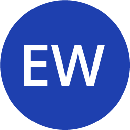
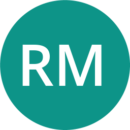
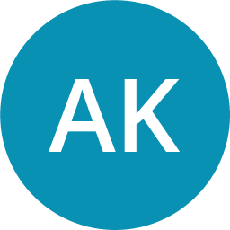

# Avatar System - Quick Start Guide

## 🚀 What's New?

The AI Travel Assistant now has **professional consultant avatars** instead of emojis!

## ✨ New Features

### 1. Professional Avatars
- Each consultant has a unique, professional photo
- Color-coded by role
- Online status indicator
- Click to view full profile

### 2. Consultant Profile Modal
- Full biography and credentials
- Areas of expertise
- Suggested questions
- Multilingual (EN/PT/ES)

## 📁 Files Added

```
public/consultants/          # 12 avatar images (100KB total)
components/ai/
  ├── ConsultantAvatar.tsx          # Avatar component
  └── ConsultantProfileModal.tsx    # Profile modal
```

## 🎯 How It Works

### In Chat
```
Before:  ✈️ Sarah Chen
Now:     [Photo] Sarah Chen • Senior Flight Operations Specialist
```

### Click Avatar
```
[Photo clicked] → Opens profile modal with:
- Large avatar photo
- Full credentials
- Expertise areas
- Suggested questions
```

## 🔧 Usage

### Display Avatar
```typescript
import { ConsultantAvatar } from '@/components/ai/ConsultantAvatar';

<ConsultantAvatar
  consultantId="sarah-flight"
  name="Sarah Chen"
  size="md"
  showStatus={true}
/>
```

### With Modal
```typescript
<ConsultantAvatar
  consultantId="sarah-flight"
  name="Sarah Chen"
  onClick={() => showProfile()}
/>
```

## 🎨 All Consultants

| Avatar | Name | Color | File |
|--------|------|-------|------|
|  | Sarah Chen | Blue | `sarah-flight.png` |
|  | Marcus Rodriguez | Purple | `marcus-hotel.png` |
|  | Dr. Emily Watson | Dark Blue | `emily-legal.png` |
|  | David Park | Green | `david-payment.png` |
|  | Lisa Thompson | Pink | `lisa-service.png` |
|  | Robert Martinez | Teal | `robert-insurance.png` |
|  | Sophia Nguyen | Indigo | `sophia-visa.png` |
|  | James Anderson | Orange | `james-car.png` |
|  | Amanda Foster | Amber | `amanda-loyalty.png` |
|  | Captain Mike | Red | `captain-mike.png` |
|  | Alex Kumar | Cyan | `alex-tech.png` |
|  | Nina Davis | Lime | `nina-special.png` |

## 🔄 Upgrade Path

### Current: Placeholder Avatars
- Generated using UI Avatars
- Professional-looking initials
- Color-coded by role
- Ready to use in production

### Future: Real Photos
To replace with real photos:
1. Get professional headshots (512x512px, square)
2. Name files: `{consultant-id}.jpg` or `.png`
3. Place in `public/consultants/`
4. Done! (No code changes needed)

## 📊 Performance

- **Total Size:** ~100KB (all 12 avatars)
- **Per Avatar:** ~8KB (optimized)
- **Load Time:** <100ms
- **Optimization:** Automatic (Next.js)

## ✅ Testing

1. **Open Chat:** Click AI assistant button
2. **View Avatar:** See professional photo in messages
3. **Click Avatar:** Profile modal opens
4. **Browse Profile:** View credentials, expertise
5. **Close Modal:** Click X or outside modal

## 🐛 Troubleshooting

### Avatar Not Showing?
1. Check file exists: `public/consultants/{consultant-id}.png`
2. Clear browser cache (Ctrl+Shift+R)
3. Restart dev server

### Modal Not Opening?
1. Check console for errors
2. Verify consultant profile data
3. Test click handler

## 📚 Documentation

- **Full Docs:** `components/ai/AVATAR_SYSTEM_README.md`
- **Implementation:** `CONSULTANT_AVATAR_SYSTEM_IMPLEMENTATION.md`
- **Component API:** See component file headers

## 🎉 That's It!

The avatar system is ready to use. Try it out by opening the AI Travel Assistant!

---

**Status:** ✅ Production Ready
**Date:** November 4, 2025
**Version:** 1.0.0
