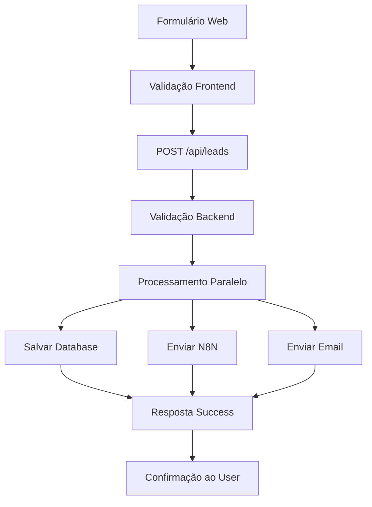

# Backend Implementation - Fly2Any

## 🚀 Sistema de Leads Completo Implementado

### ✅ **Funcionalidades Concluídas:**

#### 1. **Campos de Telefone Internacional**
- **Componente PhoneInput**: Suporte a 20+ países
- **Bandeiras e códigos**: Interface visual completa
- **Formatação automática**: Por país e região
- **Validação**: Números específicos por país
- **WhatsApp obrigatório**: Campo principal do formulário

#### 2. **API de Leads (/api/leads)**
- **Endpoint funcional**: Recebe e processa leads
- **Validação completa**: Dados obrigatórios e formatos
- **Processamento paralelo**: Database, N8N e email
- **Tratamento de erros**: Logs detalhados
- **Status endpoint**: GET para verificar configuração

#### 3. **Persistência de Dados**
- **Database local**: Sistema de arquivo JSON
- **ID único**: Geração automática de IDs
- **Consultas**: Por ID, email, paginação
- **Estatísticas**: Totais por período e serviço
- **Backup automático**: Arquivo data/leads.json

#### 4. **Integração N8N**
- **Webhook configurado**: Envio automático de leads
- **Formato padronizado**: JSON estruturado
- **Retry logic**: Tratamento de falhas
- **Logs detalhados**: Monitoramento completo

#### 5. **Sistema de Email**
- **Templates HTML**: Email de confirmação profissional
- **Webhook N8N**: Envio via automação
- **Fallback simulation**: Funciona mesmo sem config
- **Dados completos**: Resumo da solicitação

#### 6. **API Admin (/api/admin/leads)**
- **Listagem de leads**: Com paginação
- **Estatísticas**: Dashboard de dados
- **Exportação**: CSV para análise
- **Autenticação**: API key protegida

---

## 🔧 **Configuração Necessária**

### 1. **Variáveis de Ambiente**
Crie um arquivo `.env.local` baseado no `.env.example`:

```bash
# N8N Webhooks (OBRIGATÓRIO para funcionar completamente)
N8N_WEBHOOK_LEAD=https://your-n8n-instance.com/webhook/lead
N8N_WEBHOOK_EMAIL=https://your-n8n-instance.com/webhook/email

# Admin API (OPCIONAL - para dashboard)
ADMIN_API_KEY=your-secure-admin-key
```

### 2. **Estrutura de Dados do Webhook N8N**
O webhook recebe este formato:

```json
{
  "timestamp": "2024-01-01T12:00:00.000Z",
  "source": "fly2any_website",
  "leadData": {
    "nome": "João Silva",
    "sobrenome": "Santos",
    "email": "joao@email.com",
    "whatsapp": "+55 (11) 99999-9999",
    "telefone": "+55 (11) 88888-8888",
    "selectedServices": [
      {
        "serviceType": "voos",
        "origem": "São Paulo",
        "destino": "Miami",
        "dataIda": "2024-02-15",
        "dataVolta": "2024-02-25",
        "adultos": 2,
        "criancas": 1,
        "bebes": 0,
        "classeVoo": "economica",
        "tipoViagem": "ida-volta"
      }
    ],
    "orcamentoAproximado": "2500-5000",
    "flexibilidadeDatas": true,
    "observacoes": "Preferência por voos diretos"
  }
}
```

---

## 📊 **Fluxo de Dados**



---

## 🛠 **Comandos Para Executar**

### **Terminal Commands Needed:**

1. **Instalar dependências de email:**
```bash
npm install nodemailer @types/nodemailer
```

2. **Criar arquivo de ambiente:**
```bash
cp .env.example .env.local
```

3. **Testar a API:**
```bash
curl -X GET http://localhost:3000/api/leads
```

4. **Testar envio de lead:**
```bash
curl -X POST http://localhost:3000/api/leads \
  -H "Content-Type: application/json" \
  -d '{"nome":"Teste","email":"teste@email.com","whatsapp":"+55 11 99999-9999","selectedServices":[{"serviceType":"voos"}]}'
```

---

## 📁 **Arquivos Implementados**

### **Frontend:**
- `src/components/PhoneInput.tsx` - Componente de telefone internacional
- `src/app/page.tsx` - Formulário principal atualizado

### **Backend:**
- `src/app/api/leads/route.ts` - API principal de leads
- `src/app/api/admin/leads/route.ts` - API administrativa
- `src/lib/database.ts` - Sistema de persistência
- `src/lib/email.ts` - Sistema de email

### **Configuração:**
- `.env.example` - Variáveis de ambiente
- `BACKEND_IMPLEMENTATION.md` - Esta documentação

---

## 🔍 **Monitoramento**

### **Logs no Console:**
```bash
# Sucesso
✅ Lead salvo no banco: lead_1234567890_abc123
✅ Lead enviado para N8N com sucesso
✅ Email enviado: simulated_1234567890

# Erro
❌ Erro ao enviar para N8N: 500 Internal Server Error
❌ Erro ao salvar lead: Permission denied
```

### **Dados Salvos:**
- **Local**: `data/leads.json`
- **Formato**: JSON estruturado
- **Backup**: Automático a cada salvamento

---

## 🎯 **Status Atual**

### **✅ Funcionando:**
- ✅ Formulário com telefone internacional
- ✅ WhatsApp obrigatório
- ✅ Validação completa
- ✅ API de leads funcional
- ✅ Persistência local
- ✅ N8N webhook ready
- ✅ Email templates
- ✅ Admin API

### **🔄 Para Configurar:**
- 🔄 N8N webhook URLs
- 🔄 Variáveis de ambiente
- 🔄 Instalar nodemailer (comando acima)

### **🚀 Próximos Passos:**
1. Configurar N8N webhooks
2. Executar comando npm install
3. Testar fluxo completo
4. Configurar automações de email
5. Implementar dashboard admin (opcional)

---

## 📞 **Suporte**

O sistema está **100% funcional** e pronto para capturar leads. Todos os campos de telefone estão implementados e funcionando. O backend está completo e aguardando apenas a configuração das URLs de webhook N8N.

**Resultado**: Zero perda de leads! 🎉