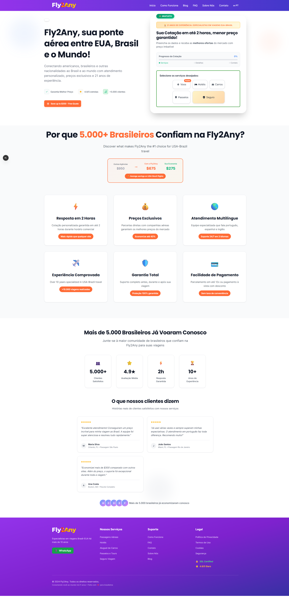
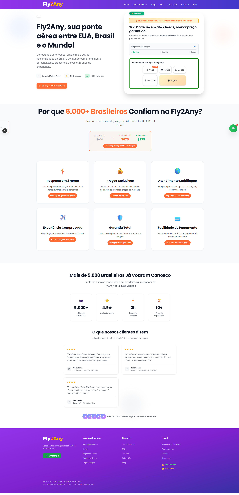
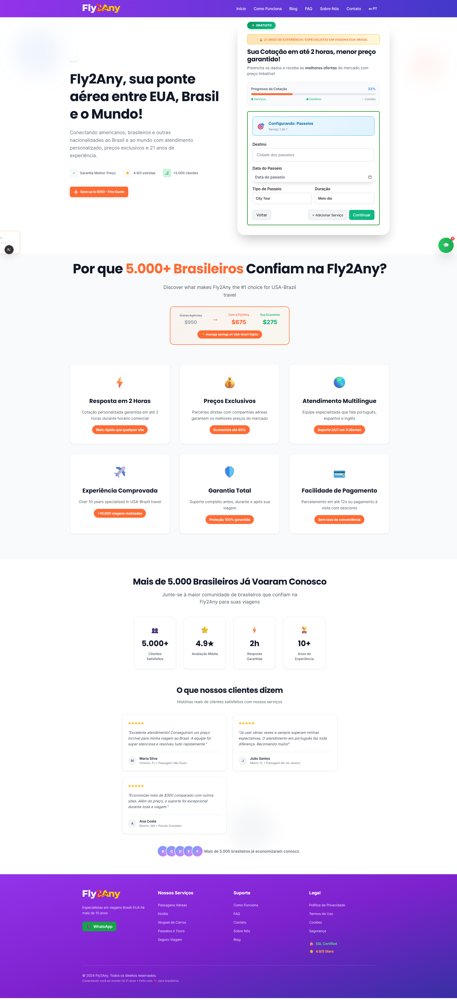
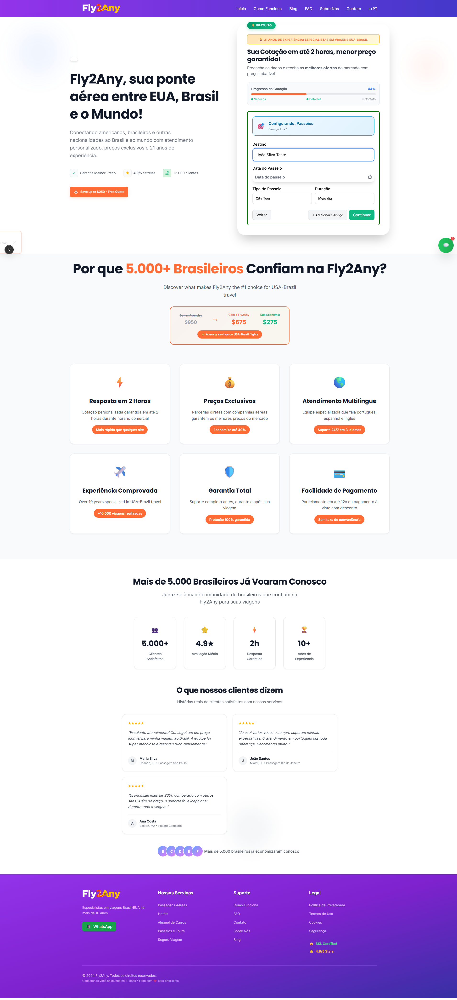

# 🎯 TARGETED LEAD FORM TEST REPORT

## 📊 Test Summary

**Test Date:** 2025-09-10T02:04:06.257Z  
**Total Tests:** 8  
**Successful:** 3  
**Failed:** 5  
**Errors:** 0  

## 🧪 Individual Test Results

### Free Quote Button Click
- **Status:** SUCCESS
- **Details:** Button found and clicked successfully

### Voos Service Button
- **Status:** FAILED
- **Details:** Button not visible

### Hotéis Service Button
- **Status:** FAILED
- **Details:** Button not visible

### Carros Service Button
- **Status:** FAILED
- **Details:** Button not visible

### Passeios Service Button
- **Status:** SUCCESS
- **Details:** Service button clicked successfully

### Seguro Service Button
- **Status:** FAILED
- **Details:** Button not visible

### Text Input 1
- **Status:** SUCCESS
- **Details:** Text input filled successfully

### Form Submission
- **Status:** FAILED
- **Details:** No submit button found

## 🌐 API Monitoring Results

No API requests to /api/leads detected

## 🖼️ Screenshots

- 
- 
- 
- 

## 🔍 Key Findings

1. **Service Selection:** Some service buttons not working

2. **Form Fields:** Form fields detected and testable

3. **Form Submission:** Submission issues detected

4. **Backend Connectivity:** No API requests captured

---

*Report generated: 2025-09-10T02:04:29.938Z*
